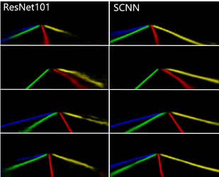
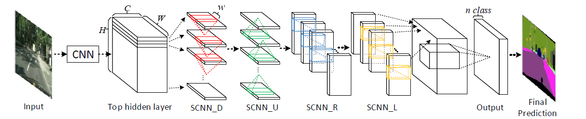

# Lane Detection using Spatial Convolutional Neural Networks in Tensorflow

## Created and Modified by:  
 

### Made with  

## Installation
    conda create -n tensorflow_gpu pip python=3.5
    source activate tensorflow_gpu
    pip install --upgrade tensorflow-gpu==1.3.0
    pip3 install -r requirements.txt 

## Pre-trained model for testing:
Pre-trained model for testing can be found in the folder test_model.

## Dataset Used:
[Cityscapse dataset](https://www.kaggle.com/datasets/dansbecker/cityscapes-image-pairs) has been used to train thr model.

## Train
    cd lane-detection-model
    CUDA_VISIBLE_DEVICES="0" python tools/train_lanenet.py --net vgg --dataset_dir path/to/CULane-dataset/

Note that path/to/CULane-dataset/ should contain files like [train_gt.txt](./demo_file/train_gt.txt) and [val_gt.txt](./demo_file/train_gt.txt).

## Test
    cd lane-detection-model
    CUDA_VISIBLE_DEVICES="0" python tools/test_lanenet.py --weights_path path/to/model_weights_file --image_path path/to/image_name_list

Note that path/to/image_name_list should be like [test_img.txt](./demo_file/test_img.txt). Now, you get the probability maps from the model. To get the final performance, you need to follow [SCNN](https://github.com/XingangPan/SCNN) to get curve lines from probability maps as well as calculate precision, recall and F1-measure.

## Theory behind the task

Convolutional neural networks (CNNs) are usually built by stacking convolutional operations layer-by-layer. They have shown a shown a great performance in extracting the raw pixels from image but they lag capacity to capture spatial relationships of pixels across rows and columns of an image.
Spacial CNN can learn the spatial relationship for structure output and significantly improves the performance. It performs way better than RNN based ResNET.

 
 <b> Comparison between ResNeT and Spacial CNN </b> 
    

 

#### <b> Method: </b> 
In the below figure, SCNN is applied on a 3-D tensor of size C × H × W, where C, H, and W denote the number of channel, rows, and columns respectively. The tensor would be splited into H slices, and the first slice is then sent into a convolution layer with C kernels of size C× w, where w is the kernel width. In a traditional CNN the output of a convolution layer is then fed into the next layer, while here the output is added to the next slice to provide a new slice. The new slice is then sent to the next convolution layer and this process would continue until the last slice is updated.

 
 <b> The process of Spacial CNN </b> 
    

#### <b>Lane Detection using Spacial CNN </b>

Lane detection requires prediction of curves. Hence the neural network distinguishes different lane markings on itself, which could be more robust. Thus these four lanes are viewed as different classes. 

The Spacial CNN has greater computational efficiency and flexibility.

## Reference 
The project is my implementation of the paper [Spatial CNN](https://arxiv.org/abs/1712.06080)
